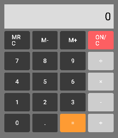
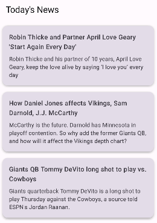

# PDM Projects
## Introduction
This repository contains projects that I have worked on while learning Kotlin in Mobile Development class. The projects on this readme are the ones that will be submitted for grading. All projects were developed using Android Studio.
## Projects
### Calculator App
This is a simple calculator app that can perform basic arithmetic operations.
### Introduction
This app has a simple UI with buttons for numbers and operations. This was the first project that I worked on in the class. It served as a good introduction to Kotlin and how to build interfaces in Android Studio.
### File Structure
#### Models
- **CalculatorBrain**: Implements the core logic for performing calculator operations.

#### UI
- **CalculatorBody**: Main container for the calculator's layout.
- **CalculatorButton**: Represents a single button in the calculator.
- **CalculatorKeypad**: Organizes buttons in a keypad layout.
- **CalculatorScreen**: Displays user input and calculation results.

#### ViewModels
- **CalculatorViewModel**: Manages app state and mediates between the UI and the business logic in `CalculatorBrain`.

#### MainActivity
- The app's entry point, setting up the user interface and connecting it to the view model.

### Features
It can perform the following operations:
- Addition
- Subtraction
- Multiplication
- Division
Additionally, it has a clear button to clear the input field and it works with both integers and floating point numbers.
It works by taking two numbers and an operation as input and then performing the operation on the two numbers. The result is then displayed on the screen.
### Screenshots

---
### News App
This is a simple news app that fetches news articles from the TheNewsAPI and displays them in a list.
### Introduction
It was the second project that I worked on in the class. It served as a good introduction to working with APIs in Android Studio.
### Limitations
- The API is limited to a 3 list of news articles.
- The API doesn't provide a full description of the news article.
- Some news don't have images, so the app show a blank space where the image should be.

### File Structure
#### Remote
##### API
- **NewsAPI**: Interface for making requests to TheNewsAPI.
##### Model
- **NewsDto**: Data transfer object for news articles.
- **NewsDetailDto**: Data transfer object for news article details.

#### Repository
- **NewsRepositoryImpl**: Implements the repository interface and fetches news articles from the API.
- **NewsDetailRepositoryImpl**: Implements the repository interface and fetches news article details from the API.

#### Domain
##### Model
- **News**: Represents a news article.
- **NewsDetail**: Represents the details of a news article.
##### Repository
- **NewsRepository**: Interface for fetching news articles.
- **NewsDetailRepository**: Interface for fetching news article details.
##### UseCase
- **GetNewsUseCase**: Fetches news articles from the repository.
- **GetNewsDetailUseCase**: Fetches news article details from the repository.

#### Presentation
##### NewsList
- **NewsListScreen**: Displays a list of news articles.
- **NewsListViewModel**: Manages app state and mediates between the UI and the business logic in `GetNewsUseCase`.
##### NewsDetail
- **NewsDetailScreen**: Displays the details of a news article.
- **NewsDetailViewModel**: Manages app state and mediates between the UI and the business logic in `GetNewsDetailUseCase`.

#### MainActivity
- The app's entry point, setting up the user interface and connecting it to the view model.

### Features
- Fetches news articles from TheNewsAPI.
- Displays news articles in a list.
- Clicking on a news article in the list displays the details of the news article.

### Screenshots
#### News List

#### News Detail

---
## How to Run
1. Clone the repository.
2. Open the project you want to run in Android Studio.
3. Run the project on an emulator or a physical device.
4. Enjoy the app!

## License
This project is property of the Instituto Politécnico do Cávado e do Ave. To use this project, please contact me.